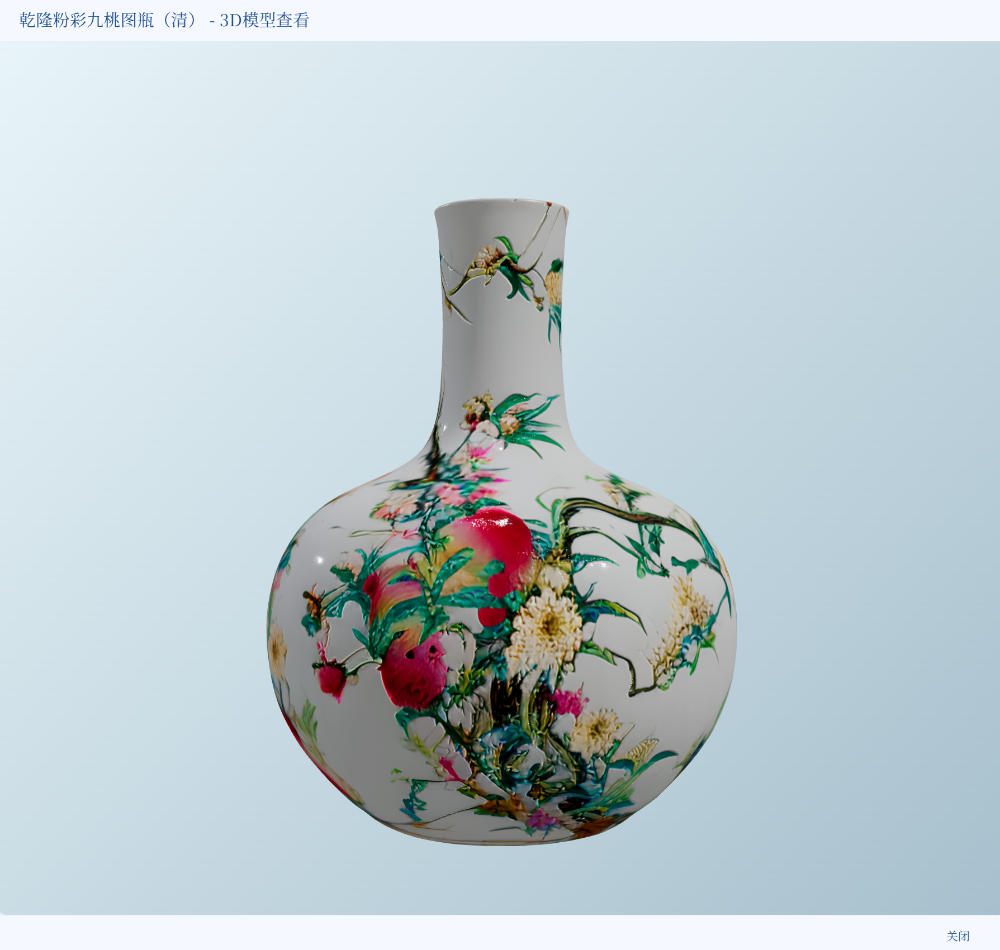
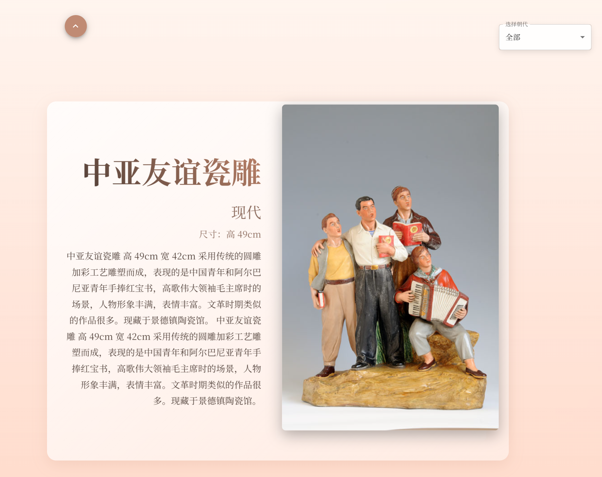
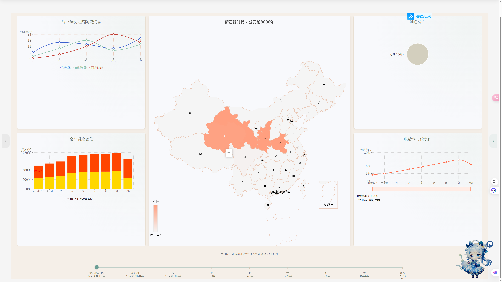
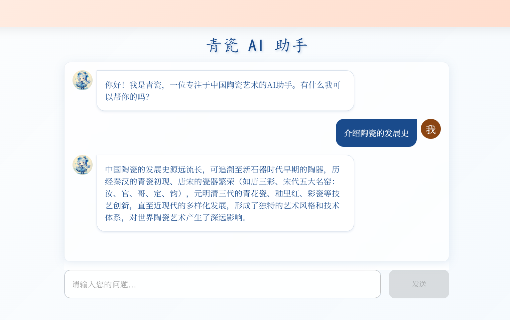
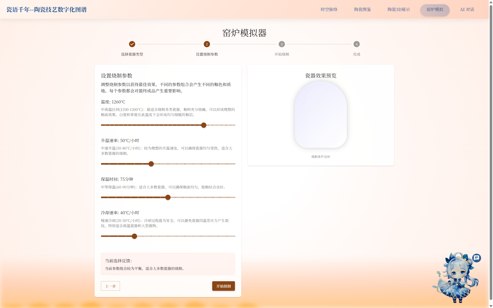
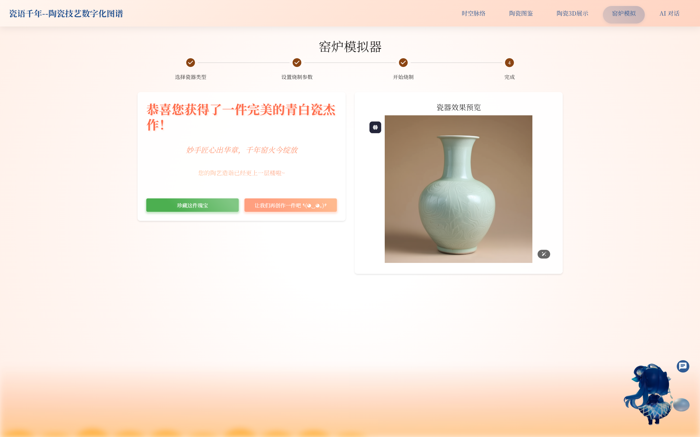
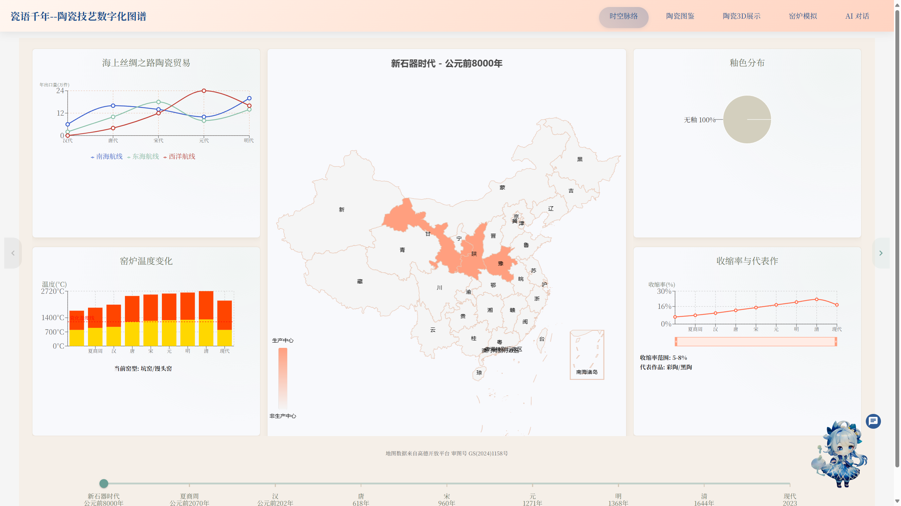

# Porcelain - 陶瓷文化展示项目

比赛项目，一个陶瓷文化主题的交互式展示网页。

## 项目说明

前端基于 React + TypeScript，后端用 Node.js 搭建简单服务。3D 展示部分使用 Three.js，利用 GLB 模型在浏览器中展示陶瓷文物。另外集成了一个 AI 对话功能用于回答陶瓷相关的问题。

## 技术栈

- **前端**: React + TypeScript, Vite
- **UI**: Material-UI (MUI), Emotion
- **3D**: Three.js, @react-three/fiber, @react-three/drei
- **动画**: Framer Motion, GSAP
- **后端**: Node.js, Express
- **爬虫**: Python（selenium）

## 功能模块

- 陶瓷 3D 模型展示（多件文物 GLB 模型）
- 陶瓷图鉴浏览
- 历史脉络地图展示
- 窑炉烧制模拟交互
- AI 助手问答
- 3D 角色引导

## 运行方式

```bash
# 前端
cd front
npm install
npm run dev

# 后端
cd server
npm install
node server.js
```

## 页面截图




3D模型展示图.png)












