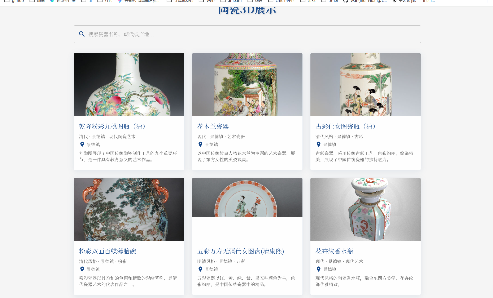

# 前端展示

## 项目概述

这是一个陶瓷艺术展示的前端项目，结合了3D模型展示、交互式体验和AI对话功能，旨在让用户通过现代化的方式了解和体验中国陶瓷文化。

## 功能特性

- **3D模型展示**：使用 Three.js 和 React Three Fiber 实现陶瓷和角色模型的3D展示
- **交互式体验**：包括陶瓷制作模拟、历史脉络展示等功能
- **AI对话系统**：集成AI聊天功能，用户可以询问陶瓷相关知识
- **响应式设计**：适配不同设备尺寸的界面展示

## 主要组件

### 3D展示功能
- [Ceramic3DViewer.tsx](./src/components/Ceramic3DViewer.tsx) - 3D陶瓷展示器
- [CeramicCharacter.tsx](./src/components/CeramicCharacter.tsx) - 3D角色模型（青瓷角色）
- [CeramicGallery.tsx](./src/components/CeramicGallery.tsx) - 陶瓷图鉴展示

### 历史与文化展示
- [CeramicHistory.tsx](./src/components/CeramicHistory.tsx) - 陶瓷历史展示
- [CeramicHistoryMap.tsx](./src/components/CeramicHistoryMap.tsx) - 历史地图展示
- [Timeline.tsx](./src/components/Timeline.tsx) - 时间轴展示

### 交互功能
- [KilnSimulator.tsx](./src/components/KilnSimulator.tsx) - 窑炉模拟器
- [AIChat.tsx](./src/components/AIChat.tsx) - AI对话功能
- [CeramicExploration.tsx](./src/components/CeramicExploration.tsx) - 陶瓷探索功能

### 页面布局
- [DefaultLayout.tsx](./src/components/DefaultLayout.tsx) - 默认页面布局
- [Navigation.tsx](./src/components/Navigation.tsx) - 导航组件

## 项目结构

```
.
├── public
│   ├── images          # 静态图片资源
│   ├── modules         # 模型文件
│   └── index.html
├── src
│   ├── assets          # 静态资源（JSON数据、地理信息等）
│   ├── components      # React组件
│   ├── pages           # 页面组件
│   ├── styles          # 样式定义
│   └── types           # 类型定义
├── package.json
└── vite.config.ts
```


## 技术栈

- **框架**: React + TypeScript
- **UI库**: Material-UI (MUI)
- **3D渲染**: Three.js + @react-three/fiber + @react-three/drei
- **动画**: Framer Motion, GSAP
- **构建工具**: Vite
- **样式**: Emotion styled

## 安装与运行

1. 安装依赖:
   ```bash
   npm install
   ```


2. 启动开发服务器:
   ```bash
   npm run dev
   ```


## 特色功能

- **智能角色引导**：项目中包含一个3D角色（青瓷），会在不同页面展示相应介绍信息
- **多维度展示**：通过时间轴、地图、3D模型等多种方式展示陶瓷文化
- **沉浸式体验**：采用视差滚动、动画过渡等效果增强用户体验
- **工艺模拟**：提供窑炉烧制模拟功能，让用户体验陶瓷制作过程

## 注意事项

- 3D模型文件较大，建议使用CDN加速
- 首次加载可能需要预加载时间
- 建议在PC端使用获得最佳体验，移动端使用低精度模型

## 项目截图





更多界面截图请参见 [images](./images) 目录。